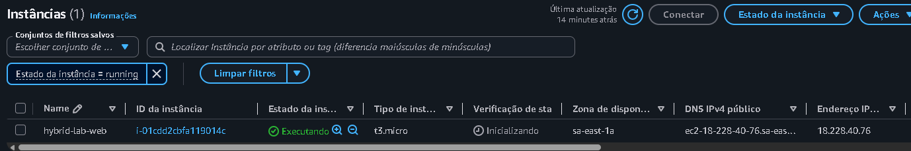
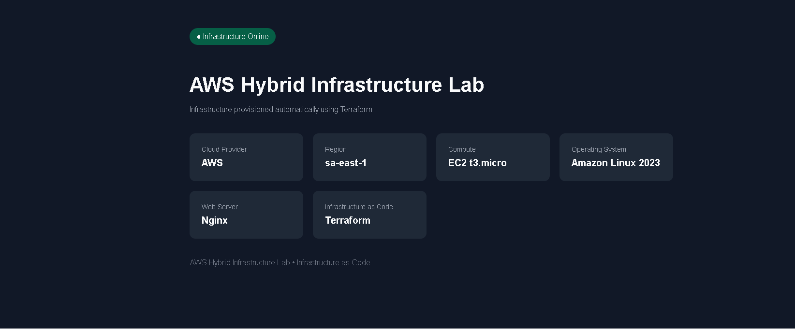

# AWS Hybrid Infrastructure Lab

Laboratório de infraestrutura em nuvem desenvolvido com **AWS + Terraform**, com foco em networking, segurança, automação, controle de custos e boas práticas de arquitetura.

---

## Overview

O objetivo deste projeto é simular uma infraestrutura corporativa em AWS utilizando **Infrastructure as Code (IaC)**.

A infraestrutura é provisionada com Terraform e foi estruturada para evoluir gradualmente de uma arquitetura simples para um ambiente com:

- VPC
- Subnets públicas e privadas
- Internet Gateway
- Security Groups
- Amazon EC2
- Application Load Balancer
- AWS Systems Manager
- CloudWatch
- Amazon RDS
- Auto Scaling
- Integração híbrida com ambiente on-premises
- CI/CD com GitHub Actions

---

## Technologies

Tecnologias utilizadas no projeto:

- AWS
- Terraform
- AWS CLI
- IAM Identity Center
- Amazon VPC
- Amazon EC2
- Amazon Linux 2023
- Nginx
- Git
- GitHub

---

## Architecture

Arquitetura atual do laboratório:

```text
                        INTERNET
                            |
                            |
                     Internet Gateway
                            |
                            |
                    Public Route Table
                      0.0.0.0/0
                            |
                +-----------+-----------+
                |                       |
         Public Subnet             Private Subnet
         10.10.1.0/24              10.10.10.0/24
                |                       |
                |                       |
        Temporary EC2             Future Workloads
        Amazon Linux 2023
             Nginx
```

A infraestrutura foi criada dentro da seguinte VPC:

```text
10.10.0.0/16
```

---

## Project Structure

```text
AWS-Hybrid-Infrastructure-Lab/
│
├── terraform/
│   ├── providers.tf
│   ├── vpc.tf
│   ├── subnets.tf
│   ├── routes.tf
│   ├── security-groups.tf
│   ├── ec2.tf
│   ├── outputs.tf
│   └── .terraform.lock.hcl
│
├── screenshots/
│   ├── 01-vpc-overview.png
│   ├── 02-subnets-overview.png
│   ├── 03-route-table.png
│   ├── 04-security-groups.png
│   ├── 05-ec2-running.png
│   └── 06-nginx-web-validation.png
│
├── README.md
└── .gitignore
```

---

## Infrastructure as Code

Toda a infraestrutura é provisionada através do Terraform.

Exemplo de configuração do AWS Provider:

```hcl
terraform {
  required_providers {
    aws = {
      source  = "hashicorp/aws"
      version = "~> 6.0"
    }
  }

  required_version = ">= 1.5.0"
}

provider "aws" {
  region  = "sa-east-1"
  profile = "terraform-lab"
}
```

A região utilizada para os recursos do laboratório é:

```text
sa-east-1
```

South America — São Paulo.

---

## Network Design

### VPC

A VPC principal utiliza:

```text
10.10.0.0/16
```

Ela foi planejada para permitir expansão futura com múltiplas subnets públicas, privadas, banco de dados e componentes híbridos.

### Public Subnet

CIDR:

```text
10.10.1.0/24
```

A subnet pública possui uma rota default:

```text
0.0.0.0/0 -> Internet Gateway
```

Essa subnet foi utilizada temporariamente para validar uma instância EC2 com Nginx.

### Private Subnet

CIDR:

```text
10.10.10.0/24
```

A subnet privada não possui exposição direta à Internet.

Ela será utilizada nas próximas etapas para:

- EC2 privada
- workloads internos
- serviços de aplicação
- componentes que não devem ser acessíveis diretamente pela Internet

---

## Internet Gateway

Foi criado um Internet Gateway e associado à VPC.

Fluxo:

```text
Internet
   |
   v
Internet Gateway
   |
   v
Public Route Table
   |
   v
Public Subnet
```

---

## Route Table

A tabela de rotas da subnet pública possui:

```text
Destination: 0.0.0.0/0
Target: Internet Gateway
```

A subnet pública é explicitamente associada a essa route table através do Terraform.

---

## Security Groups

A arquitetura utiliza Security Groups separados por função.

### ALB Security Group

Preparado para permitir acesso HTTP externo:

```text
Protocol: TCP
Port: 80
Source: 0.0.0.0/0
```

### EC2 Application Security Group

O Security Group destinado às instâncias privadas aceita tráfego HTTP apenas originado do Security Group do Application Load Balancer.

Fluxo planejado:

```text
Internet
   |
   v
Application Load Balancer
   |
   | HTTP
   v
Private EC2
```

Isso evita exposição direta das instâncias de aplicação à Internet.

---

## Authentication

A autenticação utilizada para AWS CLI e Terraform foi configurada com:

```text
AWS IAM Identity Center
        |
        v
AWS CLI
        |
        v
Terraform
        |
        v
AWS
```

O projeto não armazena Access Key ou Secret Access Key diretamente nos arquivos Terraform.

Foi criado um profile:

```text
terraform-lab
```

utilizado pelo provider:

```hcl
provider "aws" {
  region  = "sa-east-1"
  profile = "terraform-lab"
}
```

---

## EC2 Web Validation

Para validar a camada pública da infraestrutura, foi criada temporariamente uma instância Amazon EC2.

Configuração utilizada:

```text
Instance Type: t3.micro
Operating System: Amazon Linux 2023
Web Server: Nginx
Provisioning: Terraform
Bootstrap: EC2 User Data
HTTP: TCP/80
```

A instância foi provisionada automaticamente pelo Terraform.

---

## Automated Bootstrap

Durante a inicialização da instância, o EC2 User Data instala e configura automaticamente o Nginx.

Exemplo simplificado:

```bash
#!/bin/bash

dnf install -y nginx

systemctl enable nginx
systemctl start nginx
```

Após a instalação, uma página personalizada é criada automaticamente.

Fluxo:

```text
Terraform
    |
    v
Amazon EC2
    |
    v
Amazon Linux 2023
    |
    v
User Data
    |
    v
Nginx
    |
    v
HTTP Web Page
```

---

## Web Validation

Após o provisionamento, foi possível acessar a aplicação através do endereço IPv4 público temporário da instância.

A página de validação apresenta informações como:

```text
Infrastructure Status
Cloud Provider
AWS Region
EC2 Instance Type
Operating System
Web Server
Infrastructure as Code
```

Isso confirmou o funcionamento de:

- VPC
- Public Subnet
- Internet Gateway
- Route Table
- Security Group
- EC2
- User Data
- Nginx
- HTTP

---

## Screenshots

### EC2 Running



### Nginx Web Validation



---

## Security Decisions

Algumas decisões de segurança adotadas no projeto:

- Nenhuma credencial AWS armazenada no código.
- Autenticação realizada com AWS IAM Identity Center.
- Terraform State não é enviado ao GitHub.
- Security Groups separados por camada.
- SSH não será exposto diretamente à Internet na arquitetura final.
- EC2 de aplicação será movida para subnet privada.
- Tráfego de aplicação será permitido apenas através do Load Balancer.
- Subnets públicas e privadas possuem funções diferentes.
- Infraestrutura é revisada com `terraform plan` antes do `apply`.

---

## Cost Management

Foi configurado um AWS Budget para monitorar possíveis cobranças durante o laboratório.

O projeto evita manter recursos pagos ativos sem necessidade.

Recursos que podem gerar cobrança e serão utilizados apenas durante testes específicos:

- Amazon EC2
- Public IPv4
- Application Load Balancer
- Amazon RDS
- NAT Gateway
- VPC Endpoints

A estratégia utilizada é:

```text
Create
  |
  v
Test
  |
  v
Validate
  |
  v
Document
  |
  v
Destroy temporary resources
```

---

## Terraform State

Os arquivos de state do Terraform não são versionados no GitHub.

Exemplo do `.gitignore`:

```gitignore
.terraform/
*.tfstate
*.tfstate.*
*.tfplan

*.tfvars
*.tfvars.json

crash.log
crash.*.log

.vscode/
.idea/
.DS_Store
Thumbs.db
```

O arquivo:

```text
.terraform.lock.hcl
```

é mantido no repositório para garantir consistência entre versões dos providers.

---

## Terraform Workflow

Fluxo utilizado durante o desenvolvimento:

```text
terraform fmt
        |
        v
terraform validate
        |
        v
terraform plan
        |
        v
Review
        |
        v
terraform apply
```

Os comandos utilizados:

```bash
terraform fmt
terraform validate
terraform plan
terraform apply
```

Antes de qualquer alteração na infraestrutura, o plano é revisado para verificar:

```text
Resources to add
Resources to change
Resources to destroy
```

---

## Project Progress

### Foundation

- [x] Terraform installation
- [x] AWS CLI installation
- [x] IAM Identity Center
- [x] AWS SSO authentication
- [x] Terraform AWS Provider
- [x] AWS Budget

### Networking

- [x] VPC
- [x] Public Subnet
- [x] Private Subnet
- [x] Internet Gateway
- [x] Public Route Table
- [x] Route Table Association

### Security

- [x] ALB Security Group
- [x] EC2 Security Group
- [x] Security Group references
- [x] No AWS credentials stored in Terraform

### Compute Validation

- [x] Temporary Amazon EC2
- [x] Amazon Linux 2023
- [x] Nginx
- [x] Automated EC2 User Data
- [x] Public HTTP validation
- [x] Customized infrastructure page

### Next Steps

- [ ] IAM Role for EC2
- [ ] AWS Systems Manager
- [ ] Private EC2
- [ ] Application Load Balancer
- [ ] Target Group
- [ ] ALB Health Checks
- [ ] CloudWatch
- [ ] CloudWatch Alarms
- [ ] Amazon RDS
- [ ] Auto Scaling
- [ ] Multi-AZ Architecture
- [ ] Site-to-Site VPN
- [ ] Hybrid Connectivity
- [ ] GitHub Actions
- [ ] Terraform CI/CD

---

## Roadmap

### Phase 1 — Secure Compute

Próximas melhorias:

- Criar IAM Role para EC2
- Configurar AWS Systems Manager
- Provisionar EC2 em subnet privada
- Remover necessidade de SSH público

Arquitetura planejada:

```text
AWS Systems Manager
        |
        v
Private EC2
```

### Phase 2 — Application Load Balancer

Adicionar:

- Application Load Balancer
- Target Groups
- Health Checks
- Security Groups dedicados

Fluxo:

```text
Internet
   |
   v
Application Load Balancer
   |
   v
Private EC2
```

### Phase 3 — Observability

Adicionar monitoramento com:

- Amazon CloudWatch
- CloudWatch Metrics
- CloudWatch Logs
- CPU Alarms
- Instance Health
- SNS notifications

Fluxo planejado:

```text
EC2
 |
 v
CloudWatch
 |
 v
Alarm
 |
 v
SNS
 |
 v
Notification
```

### Phase 4 — Database Layer

Adicionar:

- Amazon RDS
- Private Database Subnet
- Dedicated Security Group
- Application-to-database restricted access

Fluxo:

```text
Application EC2
      |
      v
Amazon RDS
```

O banco não terá acesso público.

### Phase 5 — High Availability

Evoluir a infraestrutura para:

- Multiple Availability Zones
- Multiple Public Subnets
- Multiple Private Subnets
- Auto Scaling Group
- Load Balancing
- Health Checks

Arquitetura planejada:

```text
                   Internet
                      |
                      v
             Application Load Balancer
                      |
           +----------+----------+
           |                     |
           v                     v
       EC2 AZ-A               EC2 AZ-B
```

### Phase 6 — Hybrid Infrastructure

Simular integração entre uma infraestrutura local e AWS.

Tecnologias planejadas:

- Site-to-Site VPN
- Hybrid Routing
- Private Networks
- Secure communication

Arquitetura:

```text
On-Premises
     |
     |
Site-to-Site VPN
     |
     v
AWS VPC
```

### Phase 7 — DevOps

Adicionar pipeline utilizando GitHub Actions.

Objetivos:

- Terraform formatting validation
- Terraform validation
- Terraform plan
- Automated checks

Fluxo:

```text
GitHub
  |
  v
GitHub Actions
  |
  v
Terraform Validate
  |
  v
Terraform Plan
```

---

## Concepts Demonstrated

Este projeto demonstra conceitos práticos de:

- AWS
- Cloud Infrastructure
- Networking
- VPC
- CIDR
- Subnets
- Routing
- Internet Gateway
- Security Groups
- Amazon EC2
- Linux
- Nginx
- IAM
- AWS SSO
- Infrastructure as Code
- Terraform
- Automation
- Security
- Cost Management
- Observability
- High Availability
- Hybrid Cloud
- DevOps

---

## Repository Goals

Este laboratório foi criado com foco em:

- aprendizado prático
- desenvolvimento de portfólio
- aplicação de conceitos AWS
- infraestrutura como código
- segurança de infraestrutura
- automação
- preparação para ambientes Cloud / Infrastructure / DevOps

---

## Author

**Juliano Siqueira Barbosa**

Projeto desenvolvido como laboratório prático de:

**AWS | Cloud Infrastructure | Networking | Terraform | Infrastructure as Code**
